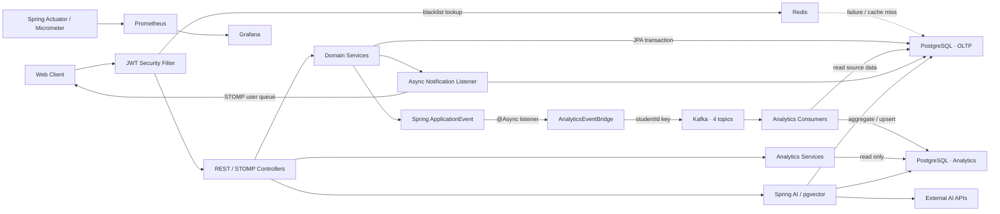

# SSCM Backend

> 학교별 성적·학생부·피드백·상담 데이터를 한곳에서 관리하고, 운영 트랜잭션과 분석 부하를 분리한 Java/Spring 기반 학생 관리 백엔드입니다.

## 30초 요약

| 질문 | 답변 |
|---|---|
| 어떤 문제를 해결하는가? | 서로 분리된 학생 기록을 역할별 권한 아래 통합하고, 교사가 한 학생의 학기별 상태를 한 화면에서 파악할 수 있게 합니다. |
| 백엔드의 핵심은? | Spring Boot 도메인 API, JWT 인증 수명주기, 학교 단위 멀티테넌시, Kafka 기반 OLTP/OLAP 분리, Redis 장애 시 DB fallback입니다. |
| 무엇으로 검증했는가? | JUnit/Mockito/MockMvc 테스트와 k6 부하·장애 주입 실험을 저장소에 함께 남겼습니다. 동일 분석 부하에서 운영 조회 p95가 **51ms → 20ms**로 낮아졌습니다. |
| 현재 상태는? | 핵심 API와 로컬 인프라 구성이 구현된 포트폴리오/시연 단계입니다. 배포 IaC는 있으나 현재 운영 중인 공개 서비스는 확인할 수 없습니다. |

### 확인 가능한 엔지니어링 기여

- 도메인: 관리자 기반 계정 등록, 학년도별 반·재학·담당 과목, 성적·학생부·피드백·상담, 알림 API
- 백엔드 구조: 운영 DB와 분석 DB를 분리하고 Spring Event → Kafka → 집계 DB로 이어지는 비동기 파이프라인 구성
- 데이터·보안: Flyway 10단계 스키마 진화, JWT Access/Refresh Token, Refresh Token Rotation, Redis + PostgreSQL 블랙리스트
- 운영: Docker Compose, AWS CloudFormation, GitHub Actions, Actuator·Prometheus·Grafana, k6 실험과 운영 가이드

> **개인 기여 표기 기준**  
> Git 구현 커밋은 `Backend Lee`, `DevOps Lee`, `QA Lee`라는 역할별 작성자명으로 나뉘고, PR 병합 커밋은 `이승희` 계정으로 기록되어 있습니다. 저장소만으로 이 작성자들이 한 사람인지, 팀원별 분담이 무엇인지 확인할 수 없어 위 항목은 **저장소 수준 기여**로만 기술했습니다.

## 프로젝트가 해결하려는 문제

SSCM은 성적, 학생부, 교사 피드백, 상담 기록이 서로 다른 흐름으로 관리될 때 생기는 다음 문제를 대상으로 합니다.

- 교사가 한 학생의 학업·출결·상담 맥락을 종합하려면 여러 데이터를 따로 조회해야 합니다.
- 학생·학부모·교사·관리자는 같은 데이터를 보더라도 허용 범위가 달라야 합니다.
- 통계성 `JOIN`·`GROUP BY` 조회가 성적 입력 같은 운영 요청과 같은 DB 자원을 사용하면 응답 지연이 전파될 수 있습니다.
- 로그아웃 토큰 확인, 알림, 분석 집계처럼 요청마다 반복되는 부가 작업이 핵심 트랜잭션을 방해하지 않아야 합니다.

## 핵심 기능

| 영역 | 구현 내용 | 현재 상태 |
|---|---|---|
| 계정·인증 | 관리자가 사전 등록한 계정의 OTP 활성화, 로그인, 토큰 갱신·회전, 로그아웃, 비밀번호 재설정 | API 구현. 실제 SMS 연동 대신 OTP를 로그에 기록 |
| 학교 운영 | 교사·학생·학부모 등록, 학부모-자녀 연결, 반 생성, 담임·학생·담당 과목 배정 | 구현 |
| 학생 기록 | 성적과 석차, 학생부, 피드백, 상담 기록의 등록·조회·수정·삭제 | 구현. 일부 수정·상세 조회 인가 보강 필요 |
| 알림 | 성적·학생부·피드백 변경 알림 저장, 읽음 처리, STOMP/SockJS 전송 | 단일 인스턴스 기준 구현 |
| 분석 | Kafka 이벤트로 성적·출결·피드백·상담을 별도 PostgreSQL에 집계하고 대시보드 API로 조회 | 최종적 일관성 방식으로 구현 |
| 멀티테넌시 | JWT의 `schoolId`, `TenantContext`, 학교별 조회 조건, 이벤트의 학교 식별자 | 주요 경로 구현. 전 API에 일관되게 적용되지는 않음 |
| AI 보조 | Spring AI 도구 호출, pgvector 의미 검색, 보고서 초안·교사 수정본·감사 로그 | 실험 기능. 설정과 인가에 미완성 부분 존재 |

## 기간·구성·역할

| 항목 | 저장소에서 확인한 내용 |
|---|---|
| 개발 기간 | 2026-03-13 ~ 2026-06-02 (`develop` 브랜치 첫/마지막 커밋 기준) |
| 저장소 규모 | Java/Spring 백엔드와 로컬·AWS 인프라, 테스트, 설계·운영 문서를 함께 관리 |
| 팀 구성 | 커밋 메타데이터만으로 실제 인원 수를 확인할 수 없음 |
| 역할 기록 | 비병합 커밋 작성자명이 Backend 79건, DevOps 26건, QA 15건으로 구분됨 |
| 개인 기여 | 역할별 작성자명과 실명 계정의 관계를 확인한 뒤 확정 필요 |

## 시스템 아키텍처



### 주요 요청·데이터 흐름

1. JWT 필터가 서명과 Access Token 블랙리스트를 확인하고 `schoolId`를 `TenantContext`에 설정합니다. 요청 종료 시 `finally`에서 컨텍스트를 제거합니다.
2. 도메인 서비스는 운영 PostgreSQL 트랜잭션 안에서 성적·기록·피드백·상담을 변경합니다.
3. 서비스가 Spring 내부 이벤트를 발행하면 비동기 브리지가 학생 ID를 Kafka key로 사용해 도메인별 4개 토픽에 전송합니다.
4. Consumer는 운영 DB의 원본 데이터를 다시 집계하고 분석 DB의 요약 테이블에 `UPSERT`합니다.
5. 대시보드 API는 분석 DB만 조회해 무거운 집계 조회와 운영 요청의 DB 자원을 분리합니다.
6. 변경 알림은 별도 비동기 리스너가 DB에 저장한 뒤 사용자별 STOMP queue로 전달합니다.

## 기술과 선택 목적

| 기술 | 사용 목적 |
|---|---|
| Java 17, Spring Boot 3.5 | 애플리케이션 기준 런타임과 REST API 기반 |
| Spring MVC, Validation | 요청 검증과 일관된 API 응답·예외 처리 |
| Spring Data JPA | 운영 도메인의 연관관계와 트랜잭션 관리 |
| JdbcTemplate | 두 DB 사이의 집계 SQL과 분석 조회를 명시적으로 제어 |
| Spring Security, JJWT, BCrypt | 역할 기반 접근, stateless JWT 인증, 비밀번호 해시 |
| PostgreSQL 16, Flyway | 운영·분석 데이터 저장과 재현 가능한 스키마 변경 |
| Kafka | 도메인 변경과 분석 집계를 분리하고 학생별 이벤트 순서를 유지 |
| Redis | 매 요청의 Access Token 블랙리스트 확인을 캐시하고 장애 시 PostgreSQL로 fallback |
| WebSocket, STOMP, SockJS | 사용자별 변경 알림 전송 |
| pgvector, Spring AI | 의미 검색과 도구 호출 기반 AI 보조 기능 실험 |
| Actuator, Micrometer, Prometheus, Grafana | JVM·HTTP·HikariCP·비즈니스 메트릭 수집과 대시보드·알림 구성 |
| JUnit 5, Mockito, MockMvc, JaCoCo | 서비스 단위 테스트, MVC 슬라이스 테스트, 커버리지 측정 |
| k6 | DB 분리 효과, 캐시 실험, Consumer 장애 격리 검증 |
| Docker, Docker Compose | PostgreSQL 2개, Kafka, Redis, 모니터링의 로컬 재현 |
| CloudFormation, ECS Fargate, RDS, MSK, ElastiCache, S3/CloudFront | AWS 인프라를 코드로 정의하고 애플리케이션·정적 프론트엔드 배포 |
| GitHub Actions, ECR, SonarCloud, OWASP Dependency-Check/ZAP | 빌드·테스트·정적 분석, 수동 배포, 의존성·동적 보안 점검 |

## 핵심 기술 문제 해결

### 1. 분석 부하가 운영 조회에 주는 영향을 DB 분리로 격리

**문제 상황**  
성적·학생부·피드백·상담을 함께 집계하는 분석 쿼리는 다수의 `JOIN`과 `GROUP BY`를 사용합니다. 이를 운영 DB에서 실행하면 성적 입력·조회와 CPU, I/O, 커넥션을 경합합니다.

**원인 분석과 검토**  
k6에서 다음 세 조건을 같은 OLTP 시나리오로 비교했습니다.

- Case A: OLTP와 분석 쿼리가 같은 운영 DB를 사용
- Case B: 분석 부하 없이 OLTP만 실행
- Case B-2: OLTP는 운영 DB, 같은 분석 부하는 별도 분석 DB에서 실행

**선택과 구현**  
운영·분석 PostgreSQL을 물리적으로 분리하고, 도메인 서비스가 Kafka를 직접 알지 않도록 Spring Event와 `AnalyticsEventBridge` 사이에 경계를 두었습니다. Consumer는 분석용 요약 테이블을 재집계하며, 초기 데이터는 backfill 서비스로 채울 수 있습니다.

**검증 결과**  
로컬에서 2분 30초 동안 OLTP 최대 50 VU와 분석 10 VU를 동시에 실행했습니다. 동일 분석 부하 기준 성적 조회 `score_read_duration` p95는 **51ms(Case A) → 20ms(Case B-2)**였고 두 조건 모두 HTTP·성적 조회 오류율은 0%였습니다. 분석 부하가 없는 Case B의 p95는 12ms였습니다.

- 스크립트: [Case A](k6/db-sep-case-a.js), [Case B-2](k6/db-sep-case-b2.js)
- 원본 결과: [Case A 결과](k6/results/case-a-result.txt), [Case B-2 결과](k6/results/case-b2-result.txt)

**남은 한계**  
현재 이벤트는 트랜잭션 커밋 이후를 보장하는 Outbox가 아니라 `@Async @EventListener`로 전송됩니다. 전송 실패 결과를 재처리하지 않고 Consumer도 예외를 로그로 남긴 뒤 삼키므로, 이 실험은 자원 격리는 보여주지만 이벤트 무손실을 증명하지는 않습니다.

### 2. Redis 응답 캐시를 측정 후 제거

**문제 상황**  
AWS 부하 테스트에서 분석 API의 p95가 791ms였고 분석 DB 조회가 지배적인 구간으로 관찰됐습니다.

**검토·구현**  
`getScoreSummary`와 `getStudentDashboard`에 5분 TTL Redis 응답 캐시를 시험 적용했습니다. cache miss 경로에는 Redis 조회, DB 조회, JSON 직렬화, Redis 저장이 추가됐습니다.

**검증 결과와 결정**  
ECS Fargate 0.5 vCPU·1GB, 최대 200 VU 조건에서 p95가 **791ms → 1,400ms**, 처리량이 **140 → 99 req/s**로 악화되어 응답 캐시는 제거했습니다. 테스트가 실제 데이터가 없는 학생 ID를 반복 조회해 cache hit가 발생하지 않았고, 제한된 CPU에서 직렬화 비용만 늘어난 것이 원인이었습니다.

**남은 한계**  
이 결과는 cache hit가 없는 특정 접근 패턴과 인프라에 한정되며 캐시 자체가 항상 느리다는 뜻은 아닙니다. 반복 조회율과 hit ratio를 다시 설계한 실험이 필요합니다. 반면 JWT 블랙리스트 캐시는 요청 경로와 장애 fallback 목적이 달라 유지했습니다.

- 결정 기록: [Analytics 응답 캐시 도입 후 제거](docs/spec/olap/step5-response-cache-rejected.md)

### 3. 학교 단위 컨텍스트를 스키마부터 이벤트까지 전파

**문제 상황**  
인프라는 여러 학교를 수용하도록 확장됐지만 초기 도메인에는 학교 경계가 없어 사용자·분석 데이터가 섞일 수 있었습니다.

**대안과 선택**  
[ADR-006](docs/spec/adr/006-multi-tenancy.md)에서 Database-per-tenant, Schema-per-tenant, Shared DB + discriminator를 비교했습니다. 현재 규모와 운영 복잡도를 고려해 공유 DB에서 `school_id`를 식별자로 사용하는 방식을 선택했습니다. 서비스 메서드 30여 개의 시그니처를 바꾸지 않기 위해 파라미터 전달 대신 요청 단위 `ThreadLocal` 컨텍스트를 사용했습니다.

**구현·검증**  
Flyway V9로 `schools`와 학교 FK를 추가하고, JWT claim → 필터 → `TenantContext` → 서비스·Kafka payload → 분석 집계로 학교 식별자를 전달했습니다. `TenantContext` 정리와 분석 접근 규칙은 단위 테스트로 검증했습니다.

**남은 한계**  
격리는 모든 코드 경로에 일관되게 적용되지 않았습니다. 성적 단건 조회와 일부 수정·삭제 서비스, AI tool 함수는 학교·소유권 검증이 충분하지 않습니다. 따라서 현재 구현을 “완전한 멀티테넌시 격리”로 표현하지 않습니다.

### 추가 장애 격리 실험

분석 Consumer 6개를 60초간 중지했다가 재개하는 2분 30초 k6 실험에서, 전 구간 성적 수정 61건은 모두 성공해 운영 API 오류율 0%를 기록했습니다. 이는 Consumer 중단이 운영 쓰기 API를 직접 막지 않는다는 근거입니다. 다만 중단 중 발생한 이벤트의 최종 반영 건수는 assert하지 않아 무손실·완전 복구의 근거로 사용하지 않습니다.

- [장애 주입 스크립트](k6/kafka-isolation-test.js)
- [원본 결과](k6/results/kafka-isolation-fixed-result.txt)

## 로컬 실행

### 요구 사항

- JDK 17
- Docker Desktop 또는 Docker Engine + Compose v2
- 사용 포트: `8080`, `5432`, `5433`, `6379`, `9092`, `2181`, `9090`, `3000`

### 1. 인프라 실행

```powershell
if (-not (Test-Path .env)) { Copy-Item .env.example .env }
docker compose up -d postgres postgres-analytics zookeeper kafka redis
docker compose ps
```

Prometheus와 Grafana까지 실행하려면 다음 명령을 사용합니다.

```powershell
docker compose up -d
```

### 2. 애플리케이션 실행

개발 프로필에는 로컬 기본값이 있지만, 실제 비밀 값은 환경 변수로 주입해야 합니다.

```powershell
$env:JWT_SECRET = "<32바이트-이상의-임의-문자열>"
.\gradlew.bat bootRun
```

macOS/Linux에서는 `./gradlew bootRun`을 사용합니다.

### 3. 확인

- Health: <http://localhost:8080/actuator/health>
- Swagger UI: <http://localhost:8080/swagger-ui.html>
- Prometheus: <http://localhost:9090>
- Grafana: <http://localhost:3000>

`/api/v1/dev/**` 시드 API는 로컬 검증용입니다. 사용하려면 `DEV_SEED_KEY`와 `DEV_SEED_ADMIN_PASSWORD`를 직접 설정하고, 외부에 노출하지 마십시오.

### 환경 변수

| 변수 | 용도 | 비고 |
|---|---|---|
| `DB_HOST`, `DB_NAME`, `DB_USERNAME`, `DB_PASSWORD` | 운영 DB 접속 | 개발 기본값 존재 |
| `ANALYTICS_DB_HOST`, `ANALYTICS_DB_PORT`, `ANALYTICS_DB_USER`, `ANALYTICS_DB_PASSWORD` | 분석 DB 접속 | DB 이름은 현재 `sscm_analytics`로 고정 |
| `REDIS_HOST` | JWT 블랙리스트 캐시 | 포트는 현재 6379로 고정 |
| `KAFKA_BOOTSTRAP_SERVERS` | Kafka broker | 개발 기본값 존재, 운영에서는 필수 |
| `JWT_SECRET` | JWT HMAC 서명 | 운영 필수, 저장소에 커밋하지 않음 |
| `DEV_SEED_KEY`, `DEV_SEED_ADMIN_PASSWORD` | 개발 시드 API 보호 | 운영에서는 시드 API 자체를 닫는 것이 필요 |
| `CLAUDE_API_KEY` | 현재 개발 프로필의 AI chat | AI 기능을 사용할 때 필요 |
| `GEMINI_API_KEY` | Gemini embedding REST 호출 | RAG 임베딩·검색에 필요 |

> `.env.example`의 `DB_USER`는 Docker Compose용이고 Spring 개발 프로필은 `DB_USERNAME`을 읽습니다. 기본 사용자명은 같지만 값을 바꿀 때는 두 변수를 함께 맞춰야 합니다. 운영 프로필은 `DB_URL`, `ANALYTICS_DB_URL`, 각 username/password와 토큰 만료 환경 변수를 별도로 사용합니다.
> `.env`는 Docker Compose가 자동으로 읽지만 Gradle `bootRun`은 자동으로 읽지 않으므로, 애플리케이션 변수는 현재 shell 또는 IDE 실행 설정에도 주입해야 합니다.

## 테스트

```powershell
.\gradlew.bat clean test --no-daemon
```

macOS/Linux:

```bash
./gradlew clean test --no-daemon
```

최근 로컬 검증(2026-09-22)에서는 414개 테스트가 발견되어 **412개 실행·2개 skip·실패 0개**였고, JaCoCo line coverage는 설정된 제외 대상을 반영해 **32.1%**였습니다.

- HTML 테스트 보고서: `build/reports/tests/test/index.html`
- JaCoCo 보고서: `build/reports/jacoco/test/html/index.html`
- 기본 테스트는 Mockito 단위 테스트와 `@WebMvcTest`가 중심입니다.
- Kafka 통합 테스트는 `@Disabled`, 전체 컨텍스트 테스트는 DB 환경 변수가 없으면 skip됩니다.
- Testcontainers와 실제 PostgreSQL 쿼리·Flyway·낙관적 락 충돌을 검증하는 자동 통합 테스트는 없습니다.

부하 테스트는 애플리케이션과 필요한 인프라를 먼저 실행한 뒤 각 스크립트의 환경 변수와 시나리오를 확인해 별도로 수행합니다.

```powershell
k6 run k6/db-sep-case-a.js
k6 run k6/db-sep-case-b2.js
k6 run k6/kafka-isolation-test.js
```

## 관련 자료

| 자료 | 링크 | 주의 사항 |
|---|---|---|
| API 문서 | 실행 후 [Swagger UI](http://localhost:8080/swagger-ui.html) | 현재 Controller 기준 |
| DB 변경 이력 | [Flyway migrations](src/main/resources/db/migration/) | 현재 스키마의 기준 자료 |
| ERD | [ERD 문서](docs/spec/db/erd.md), [Mermaid 원본](docs/spec/db/erd-diagram.mermaid) | V7 이후 일부 설명이 현재 마이그레이션과 다르므로 참고용 |
| 멀티테넌시 결정 | [ADR-006](docs/spec/adr/006-multi-tenancy.md) | 대안과 선택 근거 포함 |
| 인프라 | [인프라 아키텍처](docs/spec/infra/architecture.md), [CloudFormation](infra/) | 배포 당시 기록이며 현재 가동 여부와는 별개 |
| 모니터링 | [운영 Runbook](docs/spec/monitoring-runbook.md), [Grafana dashboard JSON](infra/monitoring/grafana/dashboards/sscm-overview.json) | 저장소에 화면 캡처는 없음 |
| 부하 테스트 | [기존 k6 보고서](k6/REPORT.md), [DB 분리 원본 결과](k6/results/) | 각 파일의 환경·시나리오를 함께 확인 |
| 보안 점검 | [OWASP ZAP HTML 보고서](docs/zap-report.html) | 2026-04 실행 기록 |

## CI/CD와 배포

- `ci.yml`: `develop`·`main` push/PR에서 Gradle test와 Dependency-Check 실행
- `sonar.yml`: `main` push 또는 수동 실행 시 JaCoCo + SonarCloud 분석
- `deploy-app.yml`: 수동 실행으로 Docker image를 ECR에 push하고 ECS 서비스를 갱신한 뒤 health check
- `zap.yml`: 수동 OWASP ZAP baseline scan과 결과 artifact 업로드
- `infra/cfn-*.yml`: ALB, ECS, RDS 2개, ElastiCache, MSK, S3/CloudFront, 모니터링 스택 정의

Docker image는 JDK/JRE 17 멀티 스테이지 빌드와 non-root 사용자로 실행됩니다. Dockerfile의 image build는 테스트를 제외하므로 배포 전 CI 통과가 선행돼야 합니다.

## 현재 상태와 기술적 한계

- **공개 운영 상태:** AWS 배포 기록과 IaC는 있지만 현재 접근 가능한 공개 URL이나 가동 상태는 저장소에서 확인할 수 없습니다.
- **이벤트 신뢰성:** Transactional Outbox, 전송 확인, retry/DLT가 없어 도메인 커밋과 Kafka 발행의 원자성 및 무손실을 보장하지 않습니다.
- **인가 일관성:** 멀티테넌시와 소유권 검사가 일부 API·서비스·AI tool 경로에서 누락돼 있습니다.
- **통합 테스트:** 기본 빌드는 성공하지만 DB·Kafka·Flyway·동시성 경로가 자동 검증 범위 밖입니다.
- **AI 설정:** 현재 작업 트리는 개발 chat을 Anthropic starter로 전환했지만 운영 프로필은 Gemini/OpenAI 호환 설정을 유지하고, embedding은 별도 Gemini REST client를 사용합니다. 배포 전 provider 설정을 하나의 정책으로 정리해야 합니다.
- **미완성 위험 알림:** `RiskDetectionConsumer`가 쓰는 `risk_alert_history` 컬럼과 V10 스키마가 일치하지 않아 현재 동작 기능으로 보지 않습니다.
- **개발 시드 보안:** `/api/v1/dev/**`가 인증 예외이며 seed key가 비어 있으면 검증을 건너뜁니다. 운영 배포에서는 프로필 제한 또는 fail-closed 처리가 필요합니다.
- **개인정보:** V2에서 도입한 컬럼 암호화는 V7에서 제거됐습니다. 현재 비밀번호·토큰은 해시하지만 이메일·전화번호·상담 내용은 애플리케이션 레벨 암호화 대상이 아닙니다.
