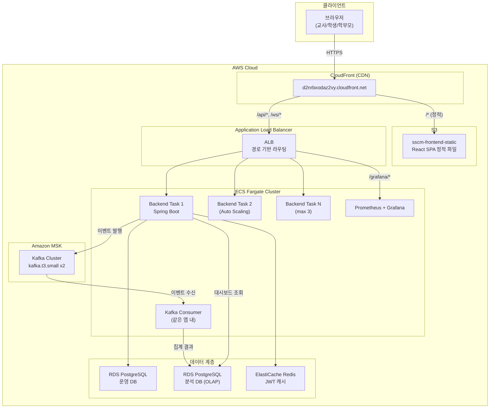
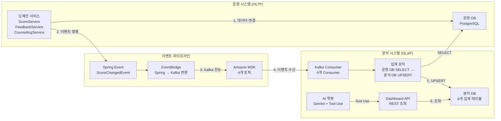
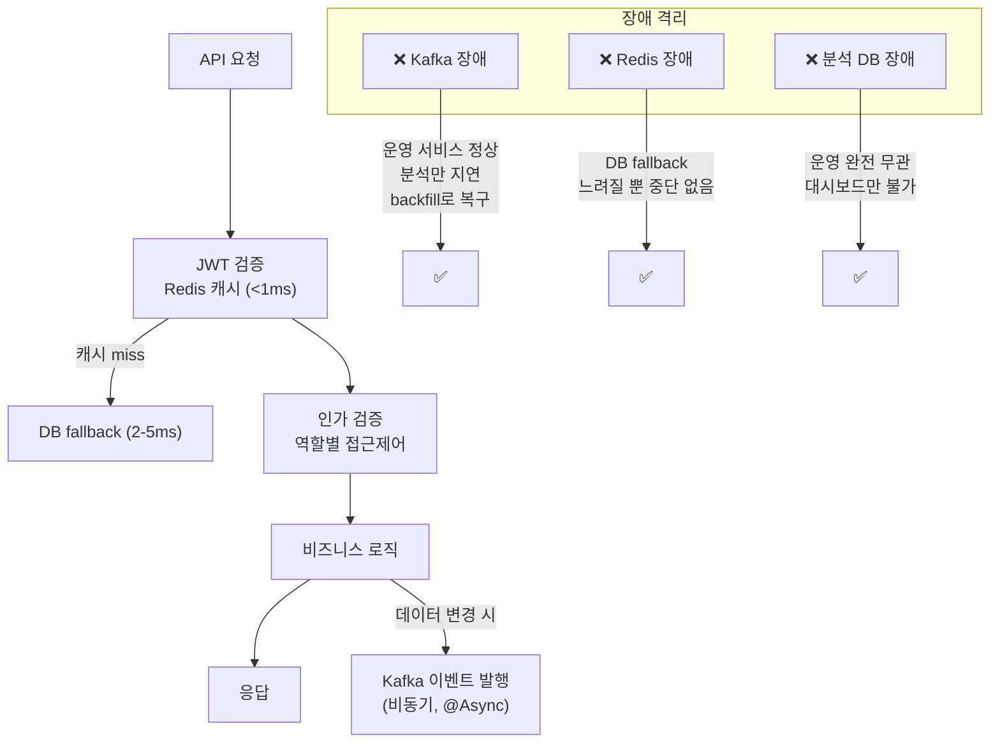
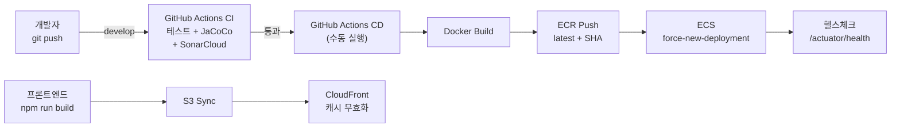

# 시스템 아키텍처 다이어그램

> PPT 발표용. draw.io 또는 Mermaid로 렌더링.

---

## 1. 전체 시스템 아키텍처

---

## 2. OLAP 데이터 파이프라인

---

## 3. 요청 흐름 + 장애 격리

---

## 4. CI/CD 파이프라인

---

## draw.io용 노트

위 Mermaid 다이어그램을 draw.io에서 다시 그릴 때 참고:

### 색상 가이드
- 클라이언트: 파란색
- ECS/컨테이너: 주황색
- 데이터베이스: 초록색
- Kafka/메시징: 보라색
- CDN/S3: 노란색
- 모니터링: 회색

### 포함할 AWS 아이콘
- ECS Fargate, ALB, RDS, ElastiCache, MSK, S3, CloudFront, CloudWatch, ECR

### 슬라이드 배치
1. 슬라이드 3: 전체 시스템 아키텍처 (1번)
2. 슬라이드 4: OLAP 데이터 파이프라인 (2번)
3. 슬라이드 5: 부하 테스트 결과 + 장애 격리 (3번 참고)
